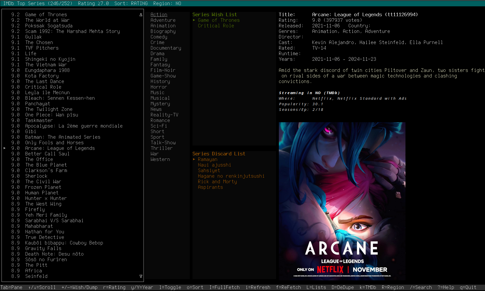

# IMDb Terminal Browser

 [](https://badge.fury.io/rb/imdb-terminal)  

 A powerful Ruby-based terminal application for discovering and managing movies and TV series from IMDb's Top 250 lists and trending lists.

> *"Cut down the time spent on searching in favor of time spent watching and cuddling"*

## ! NOTE
Version 1.1 is a complete rewrite of this IMDB application based on [rcurses](https://github.com/isene/rcurses) with a huge upgrade in functionality.

## ✓ Features

### Core Functionality
- **Browse IMDb Top 250** movies and TV series
- **Advanced filtering** by rating, year, and genres
- **Smart search** with preview mode for new content
- **Streaming information** via TMDb integration
- **Terminal poster display** using w3mimgdisplay
- **Wish and dump lists** for personal curation

### Enhanced Search Experience
- **Two-step workflow**: Search → Preview → Add
- **Jump to existing items** from search results
- **Rich preview mode** with ratings, cast, plot, and streaming info
- **Duplicate detection** and removal
- **Re-fetch capability** for corrupted data

### Data Management
- **Persistent caching** of movie/series data and posters
- **Background fetching** for smooth performance
- **Incremental updates** to refresh stale data
- **Export/import** via YAML configuration

## Screenshot
The screenshot gives you an overview of the layout of the panes:


## ✓ Installation
```bash
gem install imdb-terminal
```

### Dependencies
- **w3mimgdisplay** (for poster display): `sudo apt install w3m-img`
- **ImageMagick** (for poster processing): `sudo apt install imagemagick`
- **xdotool** (for image redraw on workspace switch): `sudo apt install xdotool`

### Quick Start
```bash
git clone <repository>
cd imdb
ruby imdb.rb
```

## ⚙️ Configuration

The application will guide you through initial setup:

1. **First run**: Automatically scrapes IMDb Top 250 lists
2. **TMDb API key** (optional): Enter your key for streaming provider information
3. **Region selection**: Choose your country for streaming availability

Configuration is stored in `~/.imdb.yml` and data cache in `~/.imdb/data/`.

### Getting TMDb API Key
1. Sign up at [themoviedb.org](https://www.themoviedb.org)
2. Go to Settings → API → Create → Developer
3. Copy your API key and enter it when prompted (press 'k')

## → Usage

### Navigation
- **Tab**: Switch between panes (List/Genres/Wish/Dump)
- **↑/↓**: Navigate within current pane
- **+/-**: Add to Wish/Dump lists or toggle genre filters
- **Enter**: Refresh screen

### Filtering
- **r**: Set minimum rating threshold
- **y/Y**: Set year range filters
- **l**: Toggle between Movies and Series view
- **o**: Toggle sort order (Rating/Alphabetical)

### Search & Discovery
- **/**: Search IMDb for new content
  - **Tab/Shift-Tab**: Navigate search results
  - **Enter**: Preview detailed information
  - **Enter again**: Add to library
  - **Esc**: Return to search or cancel

### Data Management
- **I**: Full refresh (re-scrape and download all)
- **i**: Incremental update (refresh missing data)
- **f**: Re-fetch current item details
- **v**: Verify data integrity (check for missing/incomplete data)
- **D**: Remove duplicate entries
- **L**: Load additional lists (popular movies, popular series, trending)

### Settings
- **k**: Set TMDb API key
- **R**: Select streaming region
- **?**: Show help

## ★ Advanced Features

### Genre Filtering
In the Genres pane:
- **+**: Include genre (green +)
- **-**: Exclude genre (red -)
- **Space**: Clear genre filter

### Smart Lists
- **Wish List**: Items you want to watch
- **Dump List**: Items to hide from main view
- Lists are separate for movies and series

### Background Processing
- Data fetching happens in background for smooth UI
- Progress indicators for long operations  
- Cancellable operations (press 'c')
- **Automatic verification** after bulk operations (I, L commands)
- **Duplicate prevention** when loading additional lists

## = File Structure

```
~/.imdb/
├── .imdb.yml           # Configuration
└── data/
    ├── list.json       # Movie/series metadata
    ├── details.json    # Detailed information cache
    └── *.jpg          # Poster images
```

## ! Troubleshooting

### Common Issues

**No posters displayed:**
- Ensure w3m-img is installed: `sudo apt install w3m-img`
- Check terminal supports images (works best in terminals like urxvt, kitty, iTerm2)

**Posters disappear after workspace switch:**
- Ensure xdotool is installed: `sudo apt install xdotool`
- Version 1.3.0+ includes automatic image redraw for i3 workspace switching

**Encoding errors:**
- Fixed automatically with built-in encoding handling

**Missing data:**
- Use 'f' to re-fetch current item
- Use 'i' for incremental cache refresh
- Use 'I' for complete data refresh
- Use 'v' to verify and fix data integrity issues

**Network timeouts:**
- Application includes retry logic and graceful error handling

### Debug Information
Error logs are written to:
- `/tmp/imdb_fetch_errors.log`
- `/tmp/imdb_tmdb_debug.log`

## ▩ Keyboard Reference

| Key | Action            | Key | Action                    |
|-----|-------------------|-----|---------------------------|
| Tab | Switch panes      | +/- | Wish/Dump or Genre filter |
| ↑/↓ | Navigate          | r   | Rating threshold          |
| /   | Search IMDb       | y/Y | Year filters              |
| f   | Re-fetch item     | l   | Toggle Movies/Series      |
| i   | Refresh cache     | o   | Toggle sort order         |
| I   | Full refresh      | k   | TMDb API key              |
| v   | Verify data       | R   | Streaming region          |
| D   | Remove duplicates | L   | Load more lists           |
| ?   | Help              | q   | Quit                      |

## ? What's New

This enhanced version includes:
- **Smart search workflow** with preview mode
- **Jump-to-existing** items from search
- **Duplicate management** with one-key removal
- **Data verification system** with automatic post-operation checking
- **Additional list fetching** (popular + trending content) without duplicates
- **Re-fetch capability** for data correction
- **Improved encoding** handling for international content
- **Better UX** with compact UI and auto-refresh
- **Image redraw functionality** for i3 workspace switching (v1.3.0+)

## © License

None. Borrow or steal whatever you want.

---

*Enjoy discovering your next favorite movie or series! :-)*
